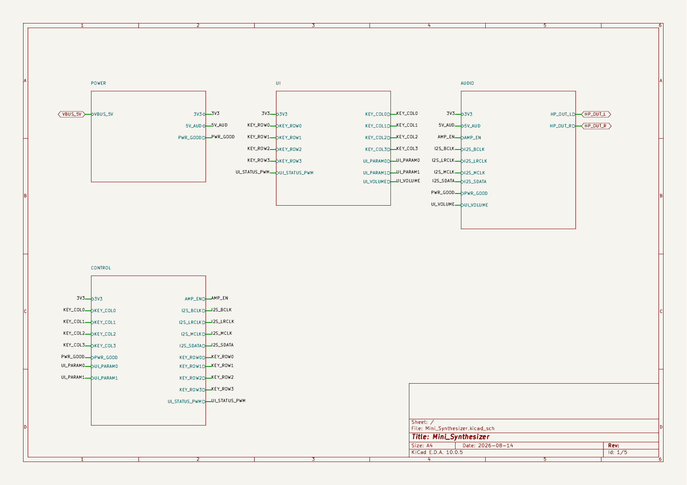
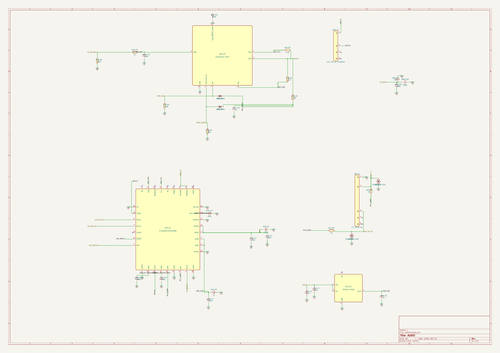

# Mini Synthesizer KiCad Schematic

This repository contains an editable KiCad 10 schematic for a compact STM32-based synthesizer. The design is organized into four sheets covering USB-C power, the main controller, the key and potentiometer interface, and the audio path.

[Download v0.1.2](https://github.com/SpeedUp-Tech/mini-synthesizer-kicad-schematic/releases/tag/v0.1.2) · [Open the live demo](https://speed-up.ai/demo/mini-synthesizer/) · [Read the project case study](https://speed-up.ai/blog/mini-synthesizer-kicad-schematic/)

## At a glance

| | |
| --- | --- |
| Main controller | STM32F411CEU6 with an 8 MHz crystal |
| Audio | TLV320DAC3101IRHBR over I2S, with headphone and speaker connections |
| Controls | 16 keys and three PTV09A-series potentiometers |
| Power | USB-C input with 3.3 V and audio-related supply stages |
| Project format | KiCad 10 project with four editable hierarchical sheets |

## Project scope

The design covers a small digital synthesizer built around the STM32F411CEU6. It includes protected USB-C power input, 3.3 V and 1.8 V rails, a programming header, a 16-key performance interface, three potentiometers, and a TLV320DAC3101 audio path. An ATtiny402 is included as a support controller on the audio sheet.

The exact source prompt was not available in the delivered project bundle. This summary was reconstructed from the schematic and supporting files and is not presented as the original user text. The complete reconstructed brief is available in [PRODUCT_REQUIREMENT.md](PRODUCT_REQUIREMENT.md).

## Schematic structure

The project is divided into four sheets so each part of the design can be reviewed and edited separately.

| Sheet | Contents |
| --- | --- |
| `POWER` | USB-C input, input protection, switched 5 V audio supply, 3.3 V regulation, and power-good supervision |
| `CONTROL` | STM32F411CEU6, 8 MHz crystal, programming header, key-matrix signals, parameter inputs, and I2S control signals |
| `UI` | Thirteen note keys, three function keys, three potentiometers, and a status LED driver |
| `AUDIO` | TLV320DAC3101 audio path, RT9013 1.8 V rail, ATtiny402 support controller, headphone output, and speaker connection |

## Repository contents

| Path | Contents |
| --- | --- |
| `hardware/` | Top-level KiCad project and four editable schematic sheets |
| `bom/` | Engineering-review bill of materials |
| `evidence/` | Schematic overview and hierarchy diagram |
| `LICENSES/` | License texts for the published hardware and documentation |
| `provenance/` | Source notes, third-party notices, and excluded-asset records |

SpeedUp generated the structured schematic sheets and editable KiCad project from the available product requirement. The repository contains the files found in the audited public bundle; it does not include PCB placement, routing, Gerbers, firmware, simulation results, or bench-test results.

Some standalone project-local library exports are not included because their redistribution provenance was not established. The exclusions are listed in [provenance/EXCLUDED_ASSETS.md](provenance/EXCLUDED_ASSETS.md).

## Bill of materials

The BOM was exported from the included schematic and contains 55 grouped rows covering 120 unique references. It is intended for design review, not purchasing. If the project is edited, treat the `.kicad_sch` files as the source of truth and regenerate the BOM.

## Key component documentation

- [STMicroelectronics STM32F411CE product page and data sheet](https://www.st.com/en/microcontrollers-microprocessors/stm32f411ce.html)
- [Texas Instruments TLV320DAC3101 product page and data sheet](https://www.ti.com/product/TLV320DAC3101)
- [Microchip ATtiny402 product page and data sheet](https://www.microchip.com/en-us/product/attiny402)
- [Richtek RT9013 product page and data sheet](https://www.richtek.com/Home/Products/Linear%20Regulator/Single%20Output%20Linear%20Regulator/RT9013) — the manufacturer marks this part as EOL; review availability and select a suitable alternative before production.

## Open in KiCad

1. Install KiCad 10 or a compatible version.
2. Download and extract the [v0.1.2 release](https://github.com/SpeedUp-Tech/mini-synthesizer-kicad-schematic/releases/tag/v0.1.2), or clone this repository.
3. Open `hardware/Mini_Synthesizer.kicad_pro`.
4. Review the hierarchy, embedded symbols, pin mappings, and footprint assignment strings before making downstream changes.

## Engineering status

Electrical validation, component ratings, safety, and manufacturability still need engineering review. See [ENGINEERING_LIMITATIONS.md](ENGINEERING_LIMITATIONS.md) for the full status.

## Licensing and provenance

SpeedUp-owned hardware design files are published under CERN-OHL-P-2.0. Original documentation and images are published under CC BY 4.0. See [LICENSE_SCOPE.md](LICENSE_SCOPE.md) and [THIRD_PARTY_NOTICES.md](THIRD_PARTY_NOTICES.md) for the exact scope and third-party notices.

## About SpeedUp

SpeedUp is an AI schematic generator that turns product requirements into structured schematic sheets and an editable KiCad project for engineering review.

## Project links

- https://speed-up.ai/blog/mini-synthesizer-kicad-schematic/
- https://speed-up.ai/demo/mini-synthesizer/
- https://speed-up.ai/

KiCad is a trademark of the KiCad project. SpeedUp is independent and is not affiliated with or endorsed by the KiCad project.
